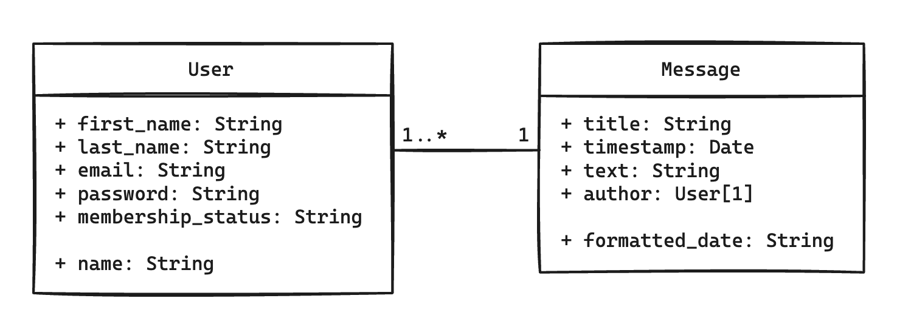

# Members Only

## Overview

A Node/Express message board with membership roles using MongoDB and PassportJS

#### Live Link: [Members Only](https://odin-members-only.adaptable.app/)

## Project Notes

An Assignment from The Odin Project.

## Features

- Session based authentication using PassportJS
- New users can register and login to create messages
- Users can provide a secret to upgrade membership and see each message's author
- Admin role allows deletion of messages

## To Do

- Refactor local strategy and auth middleware to separate files
- Refactor login to remove duplicate code

## Diagrams

